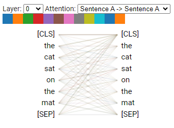

# 使用Transformer优化NLP模型

近十年来，循环神经网络（Recurrent Neural Networks, RNN）及其变体长短期记忆网络（Long Short-Term Memory, LSTM）将神经网络应用到了NLP序列模型中。然而，循环机制在处理长序列和大量参数时其能力会受限。因此，目前的最先进的Transformer模型在NLP中占据了主导地位。

这一节简要介绍了NLP中促成Transformer模型发展的背景，我们将在“:ref:`sec-2`”中更详细地描述这一背景。首先，让我们直观地看一下transformer的注意力头（Attention Head），它取代了NLP神经网络中的RNN层。

Transformer的核心概念可以粗略地概括为“混合标记（Mixing Tokens）”。自然语言处理模型首先将单词序列转换为标记（Token）。循环神经网络（RNN）通过循环函数顺序地分析标记。而Transformer则不按顺序分析标记，而是将每个标记与序列中的其他标记相关联，如图:numref:`fig-1`所示。读者可以在[这里](https://github.com/jessevig/bertviz)尝试自定义的可视化。

:label:`fig-1`

我们将在“:ref:`sec-2`”中详细介绍注意力头的细节。目前来说，从图:numref:`fig-1`可以得出的结论是，序列中的每个单词（标记）都与序列中的所有其他单词相关联。这个模型为工业4.0的自然语言处理打开了大门。

接下来让我们简要回顾一下transformer的背景。

## Transformer的背景

在过去的100多年里，许多伟大的想法致力于序列模式和语言建模的研究。因此，机器逐渐学会了预测可能的词序列。要列举所有使这成为可能的巨人，需要写一本完整的书。

本节将分享一些典型的研究者，为Transformer的出现奠定基础。

在20世纪初，安德烈·马尔可夫（Andrey Markov）引入了随机值的概念，并创立了随机过程理论。在人工智能领域，我们将其称为马尔可夫决策过程（Markov Decision Process, MDP）、马尔可夫链（Markov Chain）和马尔可夫过程（Markov Process）。在20世纪初，马尔可夫证明了我们可以仅通过过去序列的最后几个元素来预测链式序列的下一个元素。他将这种方法应用于一个包含数千个字母的数据集，利用过去的序列来预测句子中的下一个字母。请记住，他当时没有计算机，但他证明了这一理论，至今在人工智能领域仍然被使用。

1948年，克劳德·香农发表了（Claude Shannon）《通信的数学理论》（*The Mathematical Theory of Communication*）。克劳德·香农为基于源编码器、发送器和接收器或语义解码器的通信模型奠定了基础。他创立了我们今天所知的信息论。

1950年，艾伦·图灵（Alan Turing）发表了他的里程碑之作《计算机机器与智能》（*Computing Machinery and Intelligence*）。艾伦·图灵在这篇文章中基于二战期间成功解密德国密码的图灵机，提出了关于机器智能的观点。这些密码消息由一系列的单词和数字组成。

1954年，乔治敦大学（Georgetown）和IBM进行了一项实验，使用计算机通过规则系统将俄语句子翻译成英语。规则系统是一个运行一系列规则的程序，用于分析语言结构。规则系统至今仍存在并广泛应用。然而，在某些情况下，机器智能可以通过自动学习语言模式来代替规则列表，处理数十亿种语言组合。

“人工智能”这个概念的表述由约翰·麦卡锡（John McCarthy）在1956年首次使用，当时确定了机器可以进行学习的事实。

1982年，约翰·霍普菲尔德（John Hopfield）引入了一种循环神经网络（RNN），被称为霍普菲尔德网络（Hopfield Network）或“联想”神经网络（“Associative Neural Network”）。W.A.利特尔（W.A Little）在1974年写了《大脑中持久态的存在》（*The existence of persistent states*），约翰·霍普菲尔德受其启发，为学习过程奠定了几十年的理论基础。RNN得到了进一步发展，而我们今天所熟知的LSTM也随之出现。

循环神经网络（RNN）能够高效地记忆序列的持久状态，如图:numref:`fig-2`所示：

:label:`fig-2`

每个状态$S_n$捕捉了$S_{n-1}$的信息。当到达网络的终点时，函数$F$将会执行一个动作，这个动作可以是转换、建模或任何其他基于序列的任务。

<!-- 加两段解释序列转换和序列建模 -->

序列转可以理解为将一个词序列转换为另一个词序列。例如机器翻译任务将一种语言的句子转换为另一种语言。

序列建模可以理解为通过上下文对序列进行预测。例如给定一部分句子要求预测句子的下一个单词。

在20世纪80年代，杨立昆（Yann LeCun）设计了多用途的卷积神经网络（Convolutional Neural Network, CNN）。他将CNN应用于文本序列，同时也适用于序列转换和建模。它们同样基于W.A.利特尔的持久状态，逐层处理信息。在20世纪90年代，经过数年的工作总结，杨立昆开发出了LeNet-5模型，为我们今天所熟知的许多CNN模型奠定了基础。然而，CNN的高效架构在处理长期依赖关系的复杂序列时会面临问题。

还有许多其他令人敬佩的名字、论文和模型在这里没有被提及。在这些年里，似乎每个从事人工智能的人都走在正确的轨道上。在这个过程中出现了注意力的概念。注意力可以在当前状态下窥视序列中的其他所有标记，而不仅仅是最后一个标记。注意力被集成到了RNN和CNN模型中，提升了RNN和CNN的建模能力。

此后，当AI模型所需分析的序列长度开始增加时，意味着学习所需要的算力更大，AI开发者们使用更强大的机器，并找到了优化梯度的方法。一些工作基于RNN和注意力机制对序列到序列（Sequence-to-Sequence, s2s）模型进行了研究，但是并未达到预期的效果。

似乎没有其他办法可以取得更多进展。就这样过了三十年。然后，从2017年末开始，面向工业化的最先进的transformer模型出现了。Transformer具有注意力头子层（Attention Head Sublayer）等功能。至此，循环神经网络（RNN）不再是序列建模的必要条件。

在深入研究原始Transformer的架构之前（详见:ref:`sec-2`），让我们从高层次上开始，通过检视我们应该使用的软件资源的范式转变来学习和实现Transformer模型。