# Transformer模型架构

在*Attention is All You Need*这篇论文中，原始的Transformer模型由6层的堆栈组成，其中第$l$层的输出是第$l+1$层的输入，直到最后一层。如图 :numref:`fig-1` 所示，左边是一个6层的编码器堆栈，右边是一个6层的解码器堆栈。

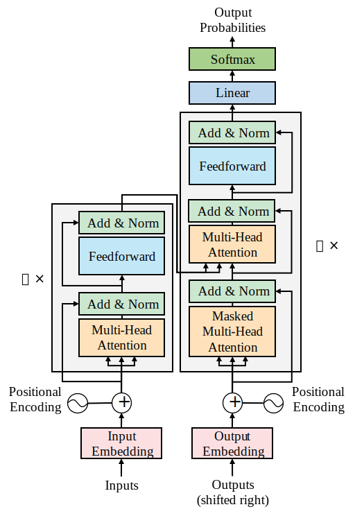
:label:`fig-1`

图中左边，输入数据在Transformer的编码器部分经过了一个注意力子层（Multi-Head Attention）和一个前馈子层（Feedforward）。图中右边，目标输出数据在Transformer的解码器部分经过了两个注意力子层（Masked Multi-Head Attention, Multi-Head Attention）和一个前馈网络子层（Feedforward）。我们注意到，Transformer架构中没有使用RNN、LSTM和CNN. 递归机制不复存在。

在RNN中，当两个单词的距离增加时，递归次数也会增加，从而参与递归运算的递归函数的参数也会增加。Transformer中注意力机制取代了递归函数。注意力机制是一种"词对词"的操作，更严格地说是一种标记对标记（Token-to-Token）的操作。在有的分词器中，一个单词会被拆成多个标记，而有的分词器中，多个单词会被聚合为一个标记。为了表述的简单，我们大多数时候不区分单词和标记的概念。注意力机制将找出每个单词与序列中的所有其他单词的关系，包括正在分析的单词本身。让我们来看下面的序列：

```
The cat sat on the mat.
```

注意力机制会在两个词向量之间执行点积运算，并且确定一个单词与其他所有单词的关系中最强的关系，包含与自身的关系（“cat”到“cat”）。图 :numref:`fig-2` 可视化了注意力机制作用在一个句子上的过程。

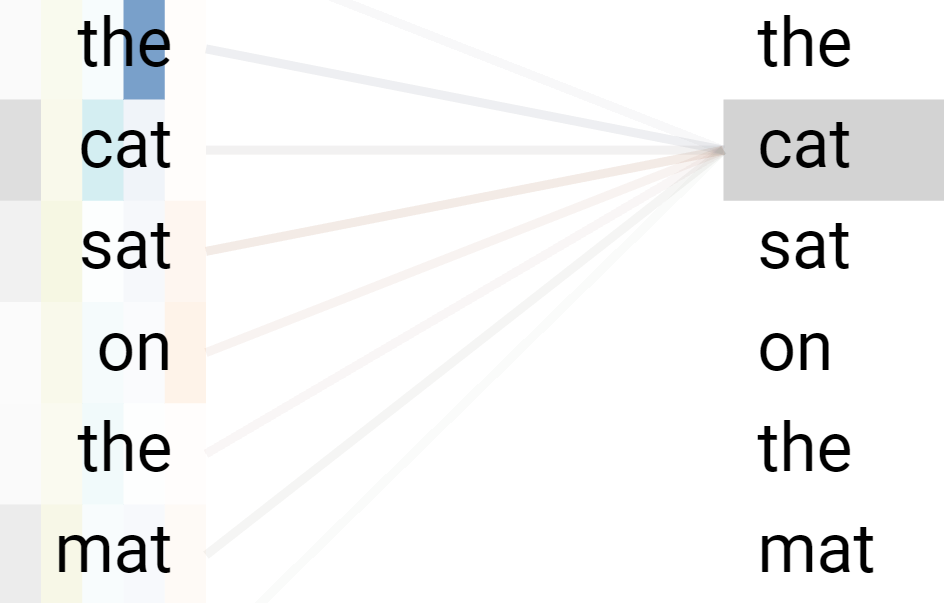
:label:`fig-2`

注意力机制将提供单词之间更深入的关系，并产生更好的结果。

对于每个注意力子层，原始的Transformer模型并行地运行了8组注意力机制，以加快计算速度。接下来我们将探索编码器堆栈和多头注意力（Multi-Head Attention）。多头注意力机制的优势如下：

- 对序列进行更广泛的深入分析
- 减少计算操作，避免了递归的需求
- 实现并行化，减少训练时间
- 每个注意力机制学习相同输入序列的不同视角

至此，我们已经浅显地从外部的视角了解了Transformer. 接下来我们来看一下Transformer编码器的内部结构。

## Transformer编码器

原始Transformer模型的编码器和解码器的层都是一堆叠的层。编码器堆栈的每一层具有如图 :numref:`fig-3` 所示的结构。图中分别展示了第1层、中间层和第$N$层的情况，因为它们的两端连接着不同的其他模块。

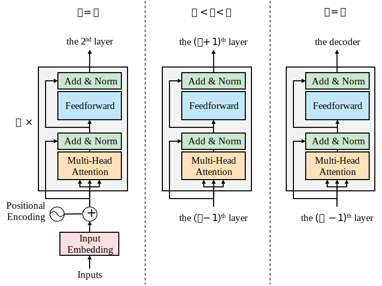
:label:`fig-3`

原始Transformer模型中，所有编码器层的结构是相同的。每一层包含两个主要的子层：多头注意力机制（Multi-Head Attention）和全连接的逐位置前馈网络（Fully Connected Position-wise Feedforward Network）。

请注意，Transformer模型中的每个主要子层$\text{sublayer}(x)$周围都有一个残差连接（Residual Connection）。残差连接将未经子层处理的输入$x$传递到层归一化（Layer Normalization）函数中。这样，我们可以确保关键信息（如位置编码）在传递过程中不会由于子层的处理而丢失。因此，每一个子层的归一化输出可以表示为：

$$
\text{LayerNorm}(x+\text{sublayer}(x))
$$

尽管编码器的每个N=6层的结构相同，但每一层的内容与前一层并不一定相同。例如，只有第1层才与嵌入层（Input Embedding）相连。其他五层不与嵌入层相连，这确保了通过所有层的编码输入是稳定的。

此外，从第1层到第6层，多头注意力机制执行的运算是相同的。然而，它们并不执行相同的任务。每一层都从前一层的输出中学习，并探索不同的方式来将序列中的tokens相关联。就像我们在玩填字游戏的时候，会寻找字母和单词的不同种类的关联。

Transformer的设计者引入了一个约束，方便层以及子层之间进行堆叠。模型的每个子层的输出都具有固定的维度，包括嵌入层和残差连接。我们用$d_\text{model}$来表示这个维度，根据不同的模型大小和用户需求可以设置不同的值。在原始的Transformer架构中，$d_\text{model}=512$.

$d_\text{model}$具有强大的影响。在Transformer中几乎所有关键的运算都是点积运算。因此，需要一个稳定的维度来减少所需的运算数量，降低机器的资源消耗，并且我们更容易追踪随运算而在模型中流动的信息。

上述Transformer编码器的整体视图展示了Transformer的高度优化架构。接下来我们将深入研究编码其中的每个子层及其机制。

### 输入嵌入层

在原始Transformer模型中，输入嵌入层（Input Embedding Layer）使用学习到的嵌入（Embeddings）将输入的tokens转换为维度为$d_\text{model}=512$的向量。

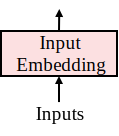

在使用输入嵌入层之前，首先需要使用分词器将一个句子转换为tokens。每种分词器都有自己的算法，例如BPE、Word Piece和Sentence Piece等。Transformer最初使用的是BPE，但后续基于Transformer的模型可能使用了其他分词算法。

我们通过一个例子来看分词器是如何工作的。给定一个句子“The cat slept on the couch.It was too tired to get up.”，某个分词器可能将其分成如下形式：

```python
['the', 'cat', 'slept', 'on', 'the', 'couch', '.', 'It', 'was', 'too', 'tired', 'to', 'get', 'up', '.']
```

注意到，这个分词器将字符串转为小写，并分成一个个的token，并且不是严格按照空格来分的。另外，分词器通常还能将token转为整数表述，以便于某些嵌入层的输入：

```python
[1996, 4937, 7771, 2006, 1996, 6411, 1012, 2009, 2001, 2205, 5458, 2000, 2131, 2039, 1012]
```

嵌入层的作用是将离散的token序列映射到连续的向量空间中。

我们借用2013年Google提出的word2vec嵌入方法中的[skip-gram架构](https://zhuanlan.zhihu.com/p/29305464)来说明Transformer的嵌入层。skip-gram在训练时会关注一个窗口中的中心词，并预测其上下文的单词。例如，如果`word[i]`是一个窗口大小为2的窗口中的中心词，skip-gram模型将利用中心词来预测`word[i-2]`、`word[i-1]`、`word[i+1]`和`word[i+2]`。然后窗口会滑动并重复这个过程。在完成训练后，一个句子中拥有类似上下文的单词会拥有类似的词嵌入。

假设我们需要对以下句子进行嵌入：

```{.python .input}
# Hide outputs
text = "The black cat sat on the couch and the brown dog slept on the rug."
```

我们将关注“black”和“brown”两个词，因为这两个词都表示颜色，且是相近的颜色，因此它们的嵌入向量应该是相似的。

对于每一个词，我们必须产生一个长度等于$d_\text{model}=512$的嵌入向量，以满足Transformer模型的维度约束。

我们首先对句子进行分词：

```{.python .input}
# Hide outputs
# 安装NLP工具包NLTK
!pip install nltk
```

```{.python .input}
# Hide outputs
from nltk.tokenize import word_tokenize

tokens = word_tokenize(text)
```

```{.python .input}
tokens
```

然后我们利用word2vec对分出来的token序列进行词嵌入。

```{.python .input}
# Hide outputs
# 安装gensim以使用word2vec模型
!pip install gensim
```

```{.python .input}
# Hide outputs
from gensim.models import word2vec

# 利用tokens来初始化word2vec模型
model = word2vec.Word2Vec([tokens], vector_size=512, window=2, min_count=1)
```

在完成嵌入后，我们可以看到，“black”的嵌入向量如下：

```{.python }
model.wv["black"]
```

“brown”的嵌入向量如下：

```{.python }
model.wv["brown"]
```

tokens序列中所有单词的嵌入向量依次拼接起来可以得到整个句子的嵌入矩阵：

```{.python .input}
# Hide outputs
import numpy as np


all_vectors = [model.wv[token] for token in tokens]
embedding_matrix = np.stack(all_vectors)
```

```{.python .input}
embedding_matrix
```


我们计算“black”与“brown”的相似度，发现得到的相似度并不高：

```{.python .input}
model.wv.similarity("black", "brown")
```

这是因为上面使用的word2vec模型只在一个句子上进行了词嵌入向量的训练，训练数据太少。接下来，我们使用Text8语料库来对word2vec进行训练。

```{.python}
# Hide outputs
# 下载并解压text8语料库
!wget http://mattmahoney.net/dc/text8.zip
!unzip text8.zip
```

```{.python .input}
# Hide outputs
import os

if not os.path.exists("word2vec.model"):
    # 加载text8语料库
    corpus = word2vec.Text8Corpus("text8")

    # 使用text8语料库初始化word2vec
    model = word2vec.Word2Vec(corpus, vector_size=512, window=2, min_count=1)

    # 保存训练后的模型
    model.save("word2vec.model")

else:
    # 直接加载上次训练好的模型
    model = word2vec.Word2Vec.load("word2vec.model")
```

在使用Text8语料库训练后，我们再来看看“black”和“brown”的相似度，发现已经提高了很多：

```{.python .input}
model.wv.similarity("black", "brown")
```

Transformer中嵌入层以后的层可以利用已经学习好的词嵌入向量。这些词嵌入向量为后续的注意力机制提供了重要的信息，这些信息将高速注意力机制如何将词语之间进行关联。

然而，有一种信息在Transformer架构中被丢失了，即词的位置信息。在递归神经网络中，token序列的输入是按顺序串行进行的，这一顺序自然隐含了token的位置信息。而在Transformer中，所有的token是被并行输入的，没有额外的向量或信息来指示一个词在序列中的位置。

Transformer的设计者提出了另一个创新特性：位置编码（Positional Encoding）。让我们看看位置编码是如何工作的。

### 位置编码

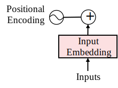

为了控制Transformer的训练时间和注意力的运算复杂度，Transformer没有单独创建另一个向量空间来描述token的位置信息。一方面是因为这样需要像训练词嵌入模型一样通过训练来得到位置信息向量（有一些基于Transformer的模型采用了可训练的位置编码），增加了训练时间。另一方面，需要将位置向量传给后续的层进行处理，需要进行更多点积运算。

Transformer的做法是使用一个固定的（不可训练的）位置编码函数，其输出向量具有固定的大小dmodel = 512（或模型的其他常量值）。然后将位置编码函数输出的位置编码向量直接加到词嵌入向量上。

原始Transformer中使用正弦和余弦函数来为每个位置$\text{pos}$和$d_\text{model}=512$维中每一个维度$i$生成相应的值：

$$
\begin{aligned}
\text{PE}(\text{pos}, 2i)&=\sin\left(\frac{\text{pos}}{10000^{\frac{2i}{d_\text{model}}}}\right) \\
\text{PE}(\text{pos}, 2i+1)&=\cos\left(\frac{\text{pos}}{10000^{\frac{2i}{d_\text{model}}}}\right)
\end{aligned}
$$

例如，第0个位置上的token的位置编码向量为$(\text{PE}(1, 1),\text{PE}(1, 2),\cdots,\text{PE}(1, 512))$.

以下是位置编码函数的简单代码实现：

```{.python .input}
# Hide outputs
import math
import numpy as np


def positional_encoding(pos, d_model=512):
    pe = [0 for _ in range(d_model)]
    for i in range(0, 512, 2):
        pe[i] = math.sin(pos / (10000 ** ((2 * i) / d_model)))
        pe[i+1] = math.cos(pos / (10000 ** ((2 * i) / d_model)))
    return np.array(pe)
```

可以由此计算得到任意位置的位置编码向量，它们都是长度为`d_model`的向量：

```{.python }
for pos in range(5):
    print(positional_encoding(pos))
```

接下来我们讨论如何将位置编码向量融合到词嵌入向量上。

#### 融合位置编码

Transformer使用一种最简单的方式将词嵌入向量与位置编码融合：直接将位置编码向量与词嵌入向量相加。我们将融合后得到的向量称为词向量（Word Vector）。

这个解决方案很直接。然而，我们可能会丢失词嵌入的信息，因为它的影响会被位置编码向量“缩小”。在上面的代码中我们可以看到，词嵌入向量与位置编码向量相差了约两个数量级。

我们直观地演示一下直接相加后会对单词的相似度所造成的影响。我们回到句子“The black cat sat on the couch and the brown dog slept on the rug.”，其中“black”在第1个位置（从0开始），“brown”在第9个位置。我们通过简单相加的方式求出两个单词的词向量：

```{.python .input}
# Hide outputs
pwev_black = model.wv["black"] + positional_encoding(1)
pwev_brown = model.wv["brown"] + positional_encoding(9)
```

然后求两个词向量的余弦相似度：

```{.python .input}
from sklearn.metrics.pairwise import cosine_similarity


cosine_similarity(pwev_black[None, ...], pwev_brown[None, ...])
```

可以发现，此时计算出来两个词向量的相似度约为`0.76`，已经远大于之前根据不带位置信息的词嵌入向量计算出来的约`0.48`. 可见，位置编码对词的语义影响太过强大。

一种简单的方式是通过将词嵌入向量乘一个较大的数来增加其影响。这个数一般可以取$\sqrt{d_\text{model}}$.

```{.python .input}
# Hide outputs
# 对词嵌入向量乘以sqrt(d_model)
pwev_black_better = model.wv["black"] * math.sqrt(512) + positional_encoding(1)
pwev_brown_better = model.wv["brown"] * math.sqrt(512) + positional_encoding(9)
```

```{.python .input}
cosine_similarity(pwev_black_better[None, ...], pwev_brown_better[None, ...])
```

可以看到，此时位置编码的影响已经被削弱，两个词向量的相似度约为`0.48`，与不带位置信息的词嵌入向量的相似度相当。

### 多头注意力子层

多头注意力（Multi-head Attention）子层包含八个注意力头（Attention Head）和一个归一化层，归一化层对注意力头的输出进行归一化，并添加残差连接，如图 :numref:`fig-4` 所示。

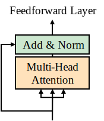
:label:`fig-4`

本节从注意力层的架构开始，然后使用Python实现了多头注意力的示例代码，最后描述了归一化层中的归一化处理和残差连接。

让我们从多头注意力的架构开始。

#### 多头注意力的架构

编码器中的第一层的多头注意力子层的输入是一组向量，其中包含了每个单词的词嵌入和位置编码。

多头注意力机制会将每个单词都与其他所有单词进行映射，从而确定该单词在序列中的重要程度和含义。

用一个符合人类直觉的例子来解释：对于句子“The cat sat on the rug and it was dry-cleaned.”，如果不看上下文，“it”可能指代“cat”，也可能指代“rug”，从而我们人脑的注意力机制会给“it”对“cat”和对“rug”分配相同的注意力权重。而当我们看到dry-cleaned时，我们会提高“it”对“rug”的注意力权重，降低“it”对“cat”的注意力权重。

Transformer的注意力机制也是这样。在刚开始时，“it”对所有单词的注意力权重是相同的。随着在大量语料上进行训练，“it”对“rug”的注意力权重会高于对“cat”的注意力权重。

输入序列中，每个单词$x_t$可以表示成一个长度为$d_\text{model}=512$的向量$\text{WE}(x_t)$，即词向量。

同理，整个句子$\mathbf{x}=(x_1,\cdots,x_N)$可以表示为一个大小为$N \times d_\text{model} = N \times 512$的矩阵$\mathbf{X}=(\text{WE}(x_1),\cdots,\text{WE}(x_N))$，我们称为词序列矩阵。

词序列矩阵$\mathbf{X}$会被输入到多头注意力（Multi-Head Attention）子层的每个注意力头（Attention Head）中，如图 :numref:`fig-5` 所示。

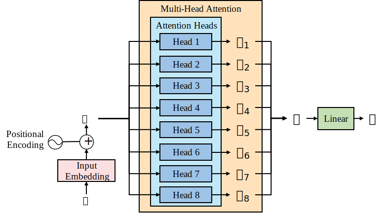
:label:`fig-5`

中间蓝色的部分分别表示$m=8$个注意力头，$\mathbf{Z}_1,\cdots,\mathbf{Z}_8$分别对应每个头的输出，输出均为$N \times d_k$的矩阵. 一般来说，$d_k=d_\text{model}/m$.

最终，所有注意力头的输出拼接为最终输出$\mathbf{Z}$，为$N\times d_k\times m = N\times d_\text{model}$的矩阵。

$\mathbf{Z}$再经过一次线性变换得到多头注意力子层的最终的输出$\mathbf{H}$（未经归一化和残差连接），$\mathbf{H}$的形状与$\mathbf{Z}$相同。

注意力头内部采用的是比例缩放点积注意力（Scaled Dot-Product Attention）运算。以Head 1为例，其内部结构如图 :numref:`fig-6` 所示。

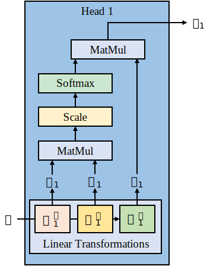

可以看到，输入矩阵$\mathbf{X}$被施加了三种线性变换，线性变换的权重分别为$\mathbf{W}^Q_1,\mathbf{W}^K_1,\mathbf{W}^V_1$，并分别得到新的矩阵$\mathbf{Q}_1,\mathbf{K}_1,\mathbf{V}_1$:

- $\mathbf{W}^Q_1$是查询权重矩阵（Query Weight Matrix），其大小为$d_\text{model} \times d_q$. $\mathbf{Q}_1=\mathbf{X}\mathbf{W}^Q_1$称为查询矩阵（Query Matrix），其形状为$N \times d_q$.
- $\mathbf{W}^K_1$是键权重矩阵（Key Weight Matrix），其大小为$d_\text{model} \times d_k$. $\mathbf{K}_1=\mathbf{X}\mathbf{W}^K_1$称为键矩阵（Key Matrix），其形状为$N \times d_k$.
- $\mathbf{W}^V_1$是值权重矩阵（Value Weight Matrix），其大小为$d_\text{model} \times d_v$. $\mathbf{V}_1=\mathbf{X}\mathbf{W}^V_1$称为值矩阵（Value Matrix），其形状为$N \times d_v$.

图 :numref:`fig-6` 中所示的$\mathbf{Q}_1,\mathbf{K}_1,\mathbf{V}_1$三者之间的运算称为缩放点积注意力（Scaled Dot-Product Attention），其中:

- MatMul表示矩阵乘法
- Scale表示将输入缩小为原来的$\frac{1}{\sqrt{d_k}}$
- Softmax表示对输入应用[softmax函数](https://zhuanlan.zhihu.com/p/105722023)

比例缩放点积注意力使用公式表示为：

$$
\text{Attention}(\mathbf{Q},\mathbf{K},\mathbf{V})=\text{softmax}\left(\frac{\mathbf{Q}\mathbf{K}^T}{\sqrt{d_k}}\right)\mathbf{V}
$$

Head 1的输出可以表示为

$$
\mathbf{Z}_1=\text{Attention}(\mathbf{Q}_1,\mathbf{K}_1,\mathbf{V}_1)
$$

其中线性变换的权重$\mathbf{W}^Q_1,\mathbf{W}^K_1,\mathbf{W}^V_1$是可训练的参数，为了得到可用的$\mathbf{Q}_1,\mathbf{K}_1,\mathbf{V}_1$，我们需要训练模型来学习这些参数。

所有头的输出拼接起来为

$$
\mathbf{Z}=\text{Concat}(\mathbf{Z}_1,\cdots,\mathbf{Z}_8)
$$

再经过一次线性变换得到子层最终的输出$\mathbf{H}$

$$
\mathbf{H}=\mathbf{Z}\mathbf{W}^O
$$

接下来，我们将使用最基本的Python代码，只使用numpy库和softmax函数，用8个步骤来实现多头注意力机制的关键部分。

#### 第1步：构建输入

首先安装numpy和scipy:

```{.python .input}
# Hide outputs
!pip install numpy scipy
```

然后导入所需要的包

```{.python .input}
# Hide outputs
import numpy as np
from scipy.special import softmax
```

为了简单和直观起见，我们将$d_\text{model}$设为4而不是512.

考虑一个长度为3的token序列，它的词序列矩阵大小应该为$3\times 4$，我们在代码里创建一个矩阵来模拟它：

```{.python .input}
X = np.array([
    [1.0, 0.0, 1.0, 0.0],
    [0.0, 2.0, 0.0, 2.0],
    [1.0, 1.0, 1.0, 1.0]
])
print(X)
```

#### 第2步：初始化权重矩阵

这里我们使用$m=2$个注意力头，从而$d_k=d_\text{model}/m=2$，并令$d_q=d_v=d_k$.

首先初始化第1个注意力头的权重矩阵$\mathbf{W}^Q_1,\mathbf{W}^K_2,\mathbf{W}^V_3$，大小均为$d_\text{model} \times d_k = 4 \times 2$.

```{.python .input}
W_Q_1 = np.array([
    [1, 0],
    [0, 1],
    [0, 0],
    [1, 1]
])
W_K_1 = np.array([
    [0, 1],
    [1, 0],
    [0, 0],
    [1, 0]
])
W_V_1 = np.array([
    [0, 2],
    [0, 3],
    [1, 0],
    [1, 1]
])
```

然后同样地初始化第2个注意力头的权重矩阵，大小与上面相同：

```{.python .input}
W_Q_2 = np.array([
    [1, 1],
    [0, 0],
    [1, 0],
    [0, 1]
])
W_K_2 = np.array([
    [1, 0],
    [0, 0],
    [0, 1],
    [1, 0]
])
W_V_2 = np.array([
    [3, 0],
    [0, 1],
    [2, 0],
    [1, 1]
])
```

#### 第3步：计算Q, K, V矩阵

计算第1个注意力头中的$\mathbf{Q}_1,\mathbf{K}_1,\mathbf{V}_1$

```{.python .input}
Q_1 = np.matmul(X, W_Q_1)
K_1 = np.matmul(X, W_K_1)
V_1 = np.matmul(X, W_V_1)
```

计算第2个注意力头中的$\mathbf{Q}_1,\mathbf{K}_1,\mathbf{V}_1$

```{.python .input}
Q_2 = np.matmul(X, W_Q_2)
K_2 = np.matmul(X, W_K_2)
V_2 = np.matmul(X, W_V_2)
```

查看一下计算得到的矩阵:

```{.python .input}
Q_1, K_1, V_1
```

```{.python .input}
Q_2, K_2, V_2
```

Q, K, V的大小均为$N \times d_k$，即$3 \times 2$

#### 第4步：计算注意力权重


第1个注意力头的最终输出为：

$$
\mathbf{Z}_1=\text{Attention}(\mathbf{Q}_1,\mathbf{K}_1,\mathbf{V}_1)=\text{softmax}\left(\frac{\mathbf{Q}_1\mathbf{K}_1^T}{\sqrt{d_k}}\right)\mathbf{V}_1
$$

我们先来算这一部分：$\left(\frac{\mathbf{Q}_1\mathbf{K}_1^T}{\sqrt{d_k}}\right)$，也被称为注意力权重矩阵:

代码如下

```{.python .input}
d_k = 2
attention_weights_1 = (Q_1 @ K_1.T) / np.sqrt(d_k)
print(attention_weights_1)
```

可以看到，注意力权重矩阵是一个大小为$N \times N = 3 \times 3$的矩阵. 

- 矩阵第$i$行第$j$列的元素表示输入的句子中第$i$个单词对第$j$个单词的注意力权重。例如，第1个单词对第3个单词的注意力权重为1.41421356
- 从行的视角看，矩阵第$i$行表示第$i$个单词对其他所有单词的注意力权重
- 从列的视角看，矩阵第$j$列表示其他所有单词对第$j$个单词的注意力权重

上面的注意力权重矩阵只是第1个注意力头的想法，我们用同样的方法计算第2个注意力头的注意力权重矩阵：

```{.python .input}
attention_weights_2 = (Q_2 @ K_2.T) / np.sqrt(d_k)
print(attention_weights_2)
```

#### 第5步：Softmax操作

对注意力权重矩阵中每一行做softmax运算：

```{.python .input}
attention_weights_1[0] = softmax(attention_weights_1[0])
attention_weights_1[1] = softmax(attention_weights_1[1])
attention_weights_1[2] = softmax(attention_weights_1[2])
print(attention_weights_1)
```

可以看到，softmax函数的直观作用是将每一行的权重之和都变为了1.

对于`attention_weights_2`我们使用更简单的softmax调用方法：

```{.python .input}
attention_weights_2 = softmax(attention_weights_2)
print(attention_weights_2)
```

#### 第6步：计算注意力头输出

第1个注意力头的输出为softmax后的注意力权重矩阵右乘值矩阵$\mathbf{V}_1$：

$$
\mathbf{Z}_1=\text{Attention}(\mathbf{Q}_1,\mathbf{K}_1,\mathbf{V}_1)=\text{softmax}\left(\frac{\mathbf{Q}_1\mathbf{K}_1^T}{\sqrt{d_k}}\right)\mathbf{V}_1
$$

第1个注意力头的输出计算代码如下：

```{.python .input}
attention_outputs_1 = attention_weights_1 @ V_1
attention_outputs_1
```

可以看到，注意力头的输出是一个大小为$N \times d_v = 3 \times 2$的矩阵，其中第$i$行是一个向量，表示第$i$个单词在$d_v$个不同维度的特征值。

第2个注意力头的输出计算代码如下：

```{.python .input}
attention_outputs_2 = attention_weights_2 @ V_2
attention_outputs_2
```

#### 第7步：拼接所有头的输出

我们使用了2个注意力头，现在将它们的输出拼接起来得到$\mathbf{Z}=\text{Concat}(\mathbf{Z}_1,\mathbf{Z}_2)$:

```{.python .input}
attention_outputs = np.concatenate([attention_outputs_1, attention_outputs_2], axis=1)
attention_outputs
```

可以看到，`attention_outputs`即$\mathbf{Z}$是大小为$N\times d_\text{model}=3 \times 4$的矩阵

#### 第8步：得到最终输出

常见的Transformer代码实现中，还需要对`attention_outputs`进行一次形状不变的线性变换:

```{.python .input}
W_O = np.array([
    [1, 0, 0, 1],
    [0, 0, 1, 1],
    [0, 1, 0, 1],
    [1, 1, 1, 1]
])
hidden_states = attention_outputs @ W_O
hidden_states
```

得到的`hidden_states`为$N\times d_\text{model}=3 \times 4$的矩阵。

`hidden_states`中的每个向量也可以看作句子中每个单词的表征。但与$X$不同的是，$X$中的每个向量只包含一个单词的信息，而`hidden_states`中的向量是通过对单词之间互相关联的注意力运算得到的，因此还能包含上下文的信息。

#### 归一化和残差连接

每一个子层（包括多头注意力子层和前馈子层）之后都有一个层后归一化模块（Post-Layer Normalization Post-LN），如图 :numref:`fig-7` 中“Add & Norm”所示。


:label:`fig-7`

Post-LN包含一个残差连接（Residual Connection）和一个层归一化（Layer Normalization）过程。残差连接简单来说就是把子层的输入加到子层的输出上。残差连接的目标是确保关键信息不会丢失。整个Post-LN过程可以表述为以下公式：

$$
\text{LayerNormalization}(\mathbf{X}+\text{Sublayer}(\mathbf{X}))
$$

其中$\mathbf{X}$是子层的输入，$\text{Sublayer}(\mathbf{X})$是子层的输出。

层归一化的输入和输出均为长度为$d_\text{model}=512$的向量。层归一化有多种实现方式，且不同模型的层归一化方式也存在不同。一种基本的实现方式如下：

$$
\text{LayerNormalization}(\boldsymbol{v})=\gamma\frac{\boldsymbol{v}-\mu}{\sigma}+\boldsymbol{\beta}
$$

其中：

- $\mu$是输入向量$\boldsymbol{v}$的均值：
  $$
  \mu=\frac{1}{d}\sum_{k=1}^dv_k
  $$

- $\sigma$是$\boldsymbol{v}$的标准差：
  $$
  \sigma^2=\frac{1}{d}\sum_{k=1}^d(v_k-\mu)^2
  $$

- $\gamma$是比例缩放参数
- $\boldsymbol{\beta}$是偏置向量

### 前馈网络子层

前馈网络（Feedforward Network, FFN）子层的输入是上一子层（多头注意力子层）的post-LN模块的输出，如图 :numref:`fig-8` 所示：

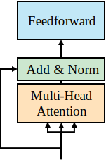
:label:`fig-8`

FFN子层具有以下特性：

- 编码器和解码器中的FFN均为[全连接网络（Fully-Connected Network, FCN）](https://ver217.github.io/2018/07/06/fc/)
- FFN采用逐位置的计算过程，采用相同的方式单独对每个位置进行计算
- FFN包含两个全连接层，并且使用ReLU激活函数
- FFN整体的输入和输出都是长度为$d_\text{model}=512$的向量，隐藏层（中间层）的输入输出维度为$d_\text{ff}=2048$，如图 :numref:`fig-9` 所示
- FFN可以被视为两个卷积核为1的[卷积层](https://paulxiong.medium.com/%E5%8D%B7%E7%A7%AF%E7%A5%9E%E7%BB%8F%E7%BD%91%E7%BB%9C%E5%88%9D%E5%AD%A6%E8%80%85%E6%8C%87%E5%8D%97-31e177fdded2)

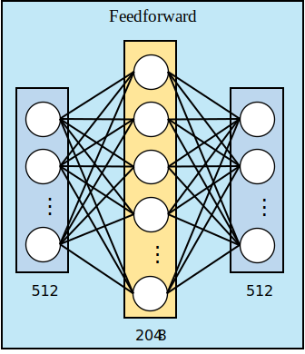
:label:`fig-9`

FFN的输出跟多头注意力的输出一样需要经过post-LN层，得到整个FFN子层的输出。FFN子层的输出会被作为编码器中下一个多头注意力子层的输入。编码器中最后一层FFN子层的输出则会被作为解码器中多头注意力子层的输入。

接下来我们来看解码器的结构。

## Transformer解码器

Transformer模型的解码器与编码器类似，都是通过多层堆叠起来的。每一个解码器层的结构如图 :numref:`fig-10` 所示。


:label:`fig-10`

每一个解码器层由三个子层组成：掩蔽多头注意力子层（Masked Multi-head Attention Layer）、多头注意力子层以及前馈网络子层。

掩蔽多头注意力子层与普通的多头注意力子层在计算注意力权重时有所不同。

- 后者在计算注意力权重时，对于每个位置的单词，都会计算其与其他所有位置的注意力权重。
- 前者在计算注意力权重时，对于每个位置的单词，会掩蔽其后续位置上单词的注意力权重。

因此，在掩蔽多头注意力子层中，每个位置的单词只能“看到”其前面的单词，而不能“看到”其后面的单词。

这一机制可以让Transformer学会只根据前面的句子来预测下一个单词。

与编码器相同，解码器中每个子层后都有“Add & Norm”模块来进行残差连接和层归一化。

与编码器相同，输出嵌入层（Output Embedding）和位置编码（Positional Encoding）的输出也只与第一层解码器相连。

解码器中各子层之间的结构以及子层的作用与编码器相似。因此，本节只重点关注二者之间不同的部分。

### 输出嵌入和位置编码

输出嵌入层和位置编码函数与编码器中的输入嵌入层和位置编码相同。

以英译中的机器翻译任务为例，输入是指原始的英文句子，输出就是我们所需要学习的中文翻译：

```python
Inputs = "The black cat set on the couch and the brown dog slept on the rug."
Outputs = "黑猫坐在沙发上，棕狗睡在地毯上。"
```

在训练阶段，正如编码器中的输入句子一样，输出句子也会经过词嵌入层和位置编码函数。

接下来我们来看解码器中的多头注意力层。

### 掩蔽多头注意力层

掩蔽多头注意力层是解码器每一层中位于下方的多头注意力子层：

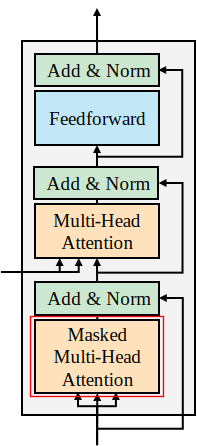

Transformer是一个[自回归模型](https://aws.amazon.com/cn/what-is/autoregressive-models/)。在自回归模型中，每一个token的预测都基于先前已有的token序列。将输出序列$\mathbf{y}$中第$t$个token记作$y_t$。在自回归模型中，要预测$y_t$，则$y_1,\cdots,y_{t-1}$必须是已知的。自回归模型会计算给定$y_1,\cdots,y_{t-1}$的条件下$y_t$的概率，即$p(y_t|y_1,\cdots,y_{t-1})$.

掩蔽多头注意力层通过对注意力权重矩阵进行掩码操作来实现自回归机制。图 :numref:`fig-11` 展示了掩蔽多头注意力与普通多头注意力中注意力头内部的点积注意力的区别。

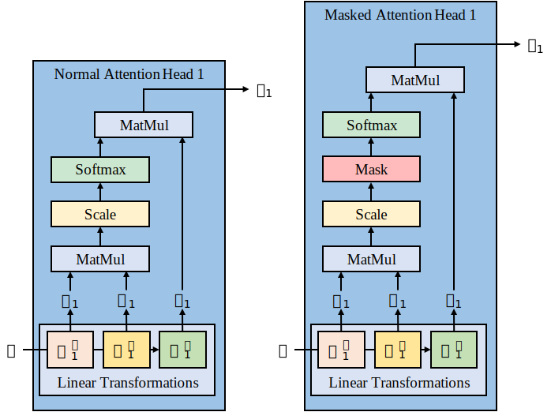
:label:`fig-11`

可以看到，掩蔽多头注意力机制在比例缩放操作（Scale）之后进行了掩蔽（Mask）操作。

掩蔽注意力机制中比例缩放点积注意力使用公式表示为：

$$
\text{Attention}(\mathbf{Q},\mathbf{K},\mathbf{V})=\text{softmax}\left(\frac{\mathbf{Q}\mathbf{K}^T}{\sqrt{d_k}}+\mathbf{M}\right)\mathbf{V}
$$

其中$\frac{\mathbf{Q}\mathbf{K}^T}{\sqrt{d_k}}$是注意力权重矩阵，大小为$N\times N$，矩阵第$i$行第$j$列的元素表示输入的句子中第$i$个单词对第$j$个单词的注意力权重。

为了实现自回归机制，我们只允许每个单词关注其前面的单词，而不允许其关注后面的单词。

因此，我们使用掩蔽矩阵$\mathbf{M}$将注意力权重矩阵中列号大于行号的元素掩蔽掉。即，掩蔽矩阵$\mathbf{M}$中第$i$行第$j$列的元素$M_{ij}$满足：

$$
M_{ij}=\left\{
    \begin{aligned}
    0, & ~i\leq j \\
    -\infty, & ~i>j &
    \end{aligned}
\right.
$$

接下来我们使用代码来演示掩蔽多头注意力的具体计算过程。

我们沿用编码器中计算得到的$\mathbf{Q}_1,\mathbf{K}_1,\mathbf{V}_1$和$\mathbf{Q}_2,\mathbf{K}_2,\mathbf{V}_2$矩阵，首先计算两个掩蔽注意力头的注意力权重矩阵：

```{.python .input}
d_k = 2
attention_weights_1 = (Q_1 @ K_1.T) / np.sqrt(d_k)
print(attention_weights_1)
```

```{.python .input}
attention_weights_2 = (Q_2 @ K_2.T) / np.sqrt(d_k)
print(attention_weights_2)
```

然后我们定义与注意力权重大小相同的掩蔽矩阵，这里我们将负无穷大实现为-10000.0：

```{.python .input}
inf = -10000.0
M = np.array([
    [0, -inf, -inf],
    [0,    0, -inf],
    [0,    0,    0],
])
```

将掩蔽矩阵与权重矩阵相加：

```{.python .input}
# 对于`array`对象而言，`+=`是就地（inplace）操作，`+`会创建新对象
attention_weights_1 = attention_weights_1 + M
attention_weights_2 = attention_weights_2 + M
```

然后进行softmax操作：

```{.python .input}
attention_weights_1 = softmax(attention_weights_1)
attention_weights_2 = softmax(attention_weights_2)
```

可以看到，每个单词对其后续单词的权重都变为接近0：

```{.python .input}
attention_weights_1
```

```{.python .input}
attention_weights_2
```

### 交叉注意力层

在解码器中，掩蔽多头注意力层之后还有一个不带掩蔽的普通多头注意力层，也称为交叉注意力（Cross-attention）层：

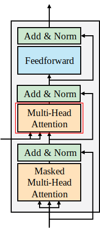

在注意力计算的过程中，按照输入来源可以分为：自注意力（Self-attention）和交叉注意力（Cross-attention）。自注意力中，$\mathbf{Q}, \mathbf{K}, \mathbf{V}$都来源于同一个序列。例如，

- 编码器层中的多头注意力就是自注意力，因为其$\mathbf{Q}, \mathbf{K}, \mathbf{V}$均来源于输入序列$\mathbf{X}$.
- 解码器层中的掩蔽多头注意力也是自注意力，因为其$\mathbf{Q}, \mathbf{K}, \mathbf{V}$均来源于输出序列$\mathbf{Y}$.

而解码器中位于中间的多头注意力层则是交叉注意力，因为其$\mathbf{Q}$来源于输出序列$\mathbf{Y}$，而其$\mathbf{K}$和$\mathbf{V}$来源于输入序列$\mathbf{X}$.

图 :numref:`fig-13` 展示了编码器中的自注意力、解码器中的自注意力以及解码器中的交叉注意力之间的区别。

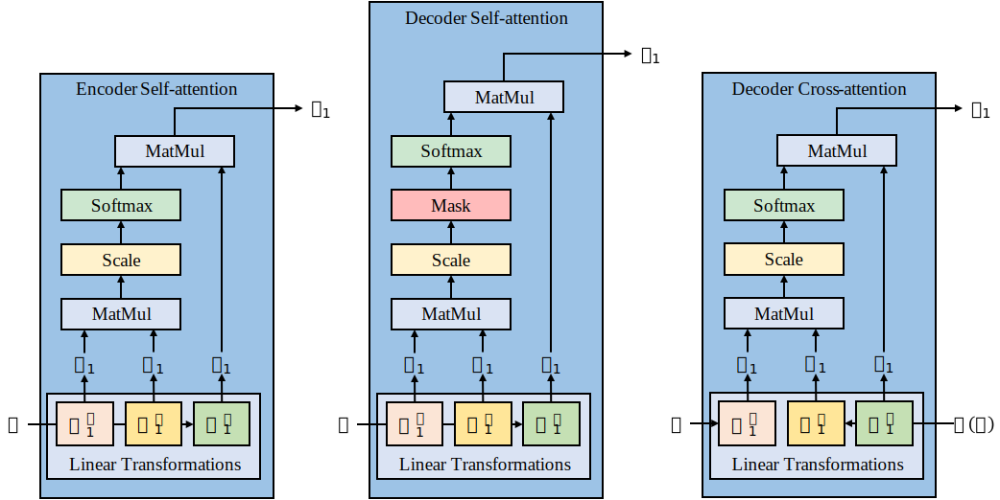
:label:`fig-13`

其中交叉注意力中$\mathbf{K}_1$和$\mathbf{V}_1$的计算都来源于编码器的最终输出$\mathbf{H}(\mathbf{X})$，归根结底来源于输入序列$\mathbf{X}$.

交叉注意力的目的是计算输出序列中每个单词对输入序列中每个单词的注意力。

假设输入序列$\mathbf{X}$的长度为$N$，输出序列$\mathbf{Y}$的长度为$M$，则交叉注意力中的注意力权重矩阵的大小应为$M \times N$，且其中第$i$行$j$列的值表示$y_i$对$x_j$的注意力权重。

其计算代码与自注意力类似，只是Q, K, V的来源不同，在此不赘述。

### 解码器中其他模块

与编码器相同：

- 解码器每一层中也有前馈网络子层（FNN）
- 每个注意力子层和FNN子层之后都有Post-LN模块进行残差连接和层归一化

与编码器不同的是，解码器的最终输出还会经过一个线性层和一个Softmax层来输出最终预测单词的概率。

- 线性层的作用是将解码器输出的$d_\text{model}=512$的特征向量转换为$d_\text{vocab}=$词表长度的向量
- Softmax的作用是将转换后的向量进一步转换为每个单词的概率

至此，我们已经基本介绍完了Transformer的架构，接下来我们来看Transformer是如何训练并取得良好表现的。
