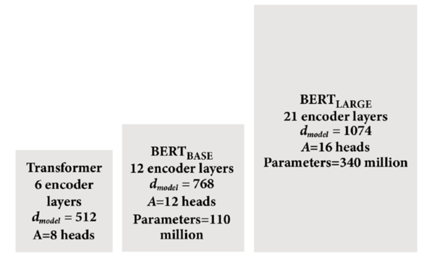
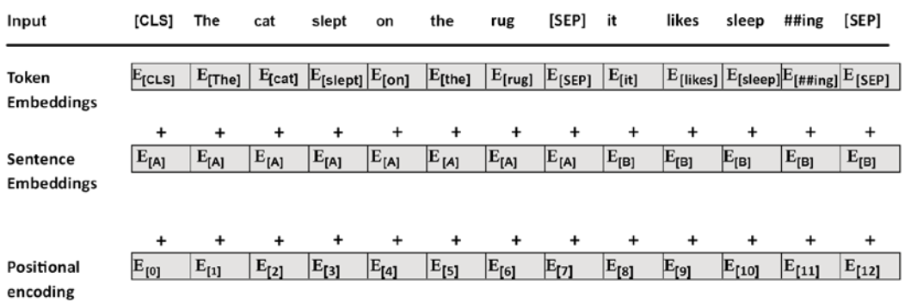
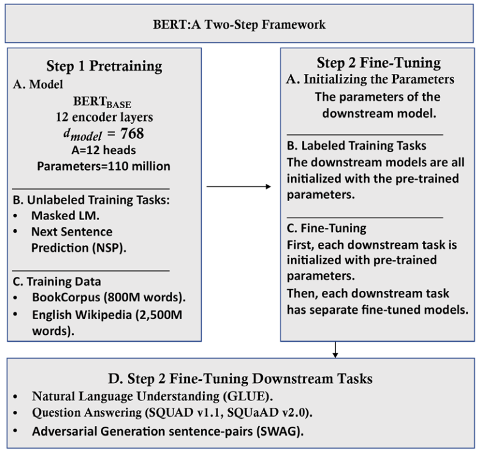

# BERT模型的架构

我们不再赘述“:ref:`chapter-2`”中描述的Transformer模型的构建模块。在本节中，我们将重点关注BERT模型的与原始Transformer中不同的地方。

我们重点关注[Devlin等人（2018年）](https://arxiv.org/pdf/1810.04805.pdf)这篇论文中设计的改进版编码器。我们首先将介绍编码器的架构，然后介绍预训练输入环境的准备工作。然后我们将描述BERT的两步训练框架：预训练和微调。

## BERT编码器

BERT只使用Transformer编码器而不使用Transformer解码器。

原始Transformer的编码器包含$N=6$层，编码器层输入输出维度为$d_\text{model}=512$，注意力头数为$m=8$，每个注意力头输出维度为$d_k=512/8=64$.

BERT的编码器层比原始Transformer模型更大。BERT的论文中使用了两种不同大小的BERT:

- $\text{BERT}_\text{BASE}$: 编码器层数$N=12$，编码器层维度$d_\text{model}=768$，也表示为$H=768$. 注意力头数量$m=12$，每个注意力头的输出$z_i$的维度仍然为$d_k=768/12=64$.
- $\text{BERT}_\text{LARGE}$: 编码器层数$N=24$，编码器维度$d_\text{model}=1024$，注意力头数量$m=16$，每个注意力头的输出$z_i$的维度仍然为$d_k=1024/16=64$.

图 :numref:`ch3-sec1-fig-1` 直观地反映了三种不同模型的大小。


:label:`ch3-sec1-fig-1`

模型的大小和维度在BERT风格的预训练中起着重要作用。BERT模型就像人类一样，在具有更大的脑容量（模型大小和维度）和更多知识（数据）时能够产生更好的结果。学习大量数据的大型Transformer模型将更好地进行下游自然语言处理任务的预训练。

接下来，我们来看看BERT模型中输入嵌入和位置编码的基本方面，首先进入第一个子层。

### 准备预训练输入环境

BERT模型没有解码器层堆叠，因此它没有掩蔽多头注意力子层。也因此，与原始Transformer不同，BERT没有采用自回归的方式（即给定部分序列，预测序列的下一个token）来进行训练。

BERT的作者提出了双向注意力机制，使得注意力头可以同时关注从左到右和从右到左的所有单词。BERT模型的训练包含两个训练目标：掩蔽式语言建模（Masked Language Modeling, MLM）和下一句子预测（Next Sentence Prediction, NSP）。

我们首先来看掩蔽式语言建模（MLM）

#### 掩蔽式语言建模（MLM）

BERT不使用自回归的训练方式，而是引入了对句子进行双向分析的方法，在句子中对一个单词进行随机遮蔽。

例如，假设输入句子如下：

```
The cat sat on it because it was a nice rug.
```

自回归的训练目标在预测“because”时只能看到该单词之前的部分，之后的部分被解码器中的掩蔽注意力机制所掩盖：

```
The cat sat on it <masked sequence>
```

而BERT则只将所需预测的词掩盖：

```
The cat sat on it [MASK] it was a nice rug.
```

需要注意的是，BERT对输入采用了一种名为[WordPiece](https://huggingface.co/learn/nlp-course/en/chapter6/6)的子词分割的分词方法（Subword Segmentation Tokenization），并且使用了可学习的位置编码，而不是采用固定的正弦-余弦函数。

现在，多头注意力子层可以看到整个输入序列，对序列运行自注意力计算，并预测被掩蔽的token.

BERT通过以下三种方法对输入序列中的token进行掩蔽，对于被选中进行掩蔽的token：

- 有80%的概率将其替换为特殊token `[MASK]`:
  ```
  The cat sat on it [MASK] it was a nice rug.
  ```
- 有10%的概率将其替换为词表中的随机单词：
  ```
  The cat sat on it [often] it was a nice rug.
  ```
- 有10%的概率保持原样，不进行掩蔽。示例如下：
  ```
  The cat sat on it [because] it was a nice rug.
  ```

其中后两种方法可以防止模型过拟合。

接下来介绍另一个训练目标：下一句子预测（NSP）

#### 下一句子预测（NSP）

下一句子预测并不是预测下一个句子，而是将两个句子拼接，让BERT判断第二个句子是否是第一个句子的下一个句子。

在构建输入时，正样本和负样本分别占50%. 正样本通常是从数据集中选取的一对连续句子。负样本则是使用来自不同文档的序列进行创建。

NSP输入的构建流程如下。给定两个句子：

```
The cat slept on the rug. It likes sleeping all day.
```

BERT会将其分词并拼接为如下形式：

```
[CLS] the cat slept on the rug [SEP] it likes sleep ##ing all day[SEP]
```

其中“##ing”就是我们前面提到的WordPiece算法的产物，它将一个单词分为多个子词；`[CLS]`和`[SEP]`又是两种不同的特殊token:

- `[CLS]`是一个分类标记，添加在第一个序列的开头，用于预测第二个序列是否跟随在第一个序列之后。
- `[SEP]`是一个分隔标记，用于标识一个序列的结束。

为了区分句子A和句子B，在进行NSP时需要引入额外的编码信息，如图 :numref:`ch3-sec1-fig-2` 所示：


:label:`ch3-sec1-fig-2`

其中Token Embeddings对每个token做嵌入，得到token嵌入向量；Positional Encoding对token的位置做嵌入，得到位置编码向量；这两个嵌入模块在原始Transformer架构中都有，只不过BERT中的Positional Encoding是可学习的。

Sentence Embeddings（又称Segment Embeddings，句段嵌入）用于在NSP任务中区分第一个句子和第二个句子。同一个句子内各token的句段嵌入向量是相同的。

BERT模型的输入嵌入和位置编码子层可以总结如下：

- 输入词序列被分解成WordPiece token序列
- 为了进行掩蔽式语言建模（MLM）训练，使用`[MASK]` token随机替换原始token
- 为了进行分类任务，在序列开头添加`[CLS]` token
- 为了进行下一句子预测（NSP）训练，使用`[SEP]`隔开两个句子
- 将句段嵌入向量（Segment Embeddings）加到token嵌入向量中，使得句子A和句子B具有不同的句子嵌入值
- 位置编码是可学习的，不采用原始Transformer的正弦-余弦位置编码方法

BERT还有一些额外的关键特点：

- BERT在其多头注意力子层中使用双向注意力，打开了学习和理解标记之间关系的广阔视野。
- BERT的MLM训练目标引入了无监督嵌入的场景，使用无标签文本对预训练模型进行训练。无监督场景迫使模型在多头注意力学习过程中更加努力思考。这使得BERT能够学习语言的构建方式，并将这些知识应用于下游任务，而无需每次都进行预训练。
- BERT同时使用了有监督学习（NSP训练目标）。

### BERT模型的预训练和微调

BERT是一个两步训练框架。其中第一步是预训练，第二步是微调，如图 :numref:`ch3-sec1-fig-3` 所示。


:label:`ch3-sec1-fig-3`

训练一个Transformer模型可能需要几个小时，甚至几天的时间。设计模型架构、调整参数以及选择适当的数据集来训练Transformer模型都需要相当一段时间进行工程化处理。

BERT框架的第一步是预训练（Pre-training），可以分为两个子步骤：

- 定义模型的架构：层数、头数、维度以及模型的其他构建块
- 在掩蔽式语言建模（MLM）和下一句子预测（NSP）任务上对模型进行训练

BERT框架的第二步是微调（Fine-tuning），也可以分为两个子步骤：

- 使用预训练的BERT模型的训练参数初始化所选择的下游模型。
- 针对特定的下游任务（如文本推理、问答、以及对抗生成等），对参数进行微调。

我们已经学习了BERT架构以及其预训练和微调的框架。现在让我们来对一个BERT模型进行微调。
