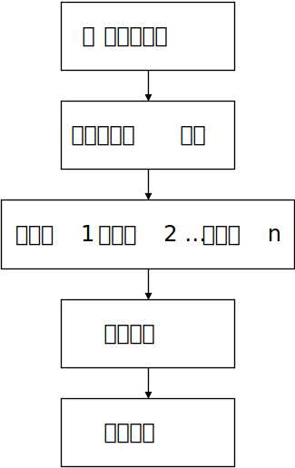

# 机器翻译的定义

机器翻译是通过机器进行转换和输出来复现人类翻译的过程：

:label:`ch6-sec1-fig-1`

:numref:`ch6-sec1-fig-1` 中的总体思路是让机器通过以下几个步骤来完成：

- 选择要翻译的句子
- 利用数亿个参数学习单词之间的关系
- 学习单词彼此之间的多种表达方式
- 使用机器转换将学习到的参数传递给新的序列
- 为单词或序列选择候选翻译

该过程始终从源语言A中选择一个要翻译的句子作为起点，最终生成一个包含语言B中翻译句子的输出结果。中间的计算过程涉及到转导操作。

## 人类转导与翻译

例如，欧洲议会的人工口译员不会逐字逐句地进行翻译。逐字逐句的翻译通常没有意义，因为它们缺乏正确的语法结构，无法正确翻译，因为忽略了每个词的上下文。

人类的转导过程是将语言A中的句子构建成一个认知表示，表示该句子的意义。在欧洲议会，口译员或笔译员将会将这种转导过程转化为语言B中对该句子的解释。

我们将口译员或翻译员在语言B中完成的翻译称为参考句（Reference）。

在现实生活中，人类翻译员不会将句子A翻译成句子B多次，而只会翻译一次。然而，在现实生活中，可能会有多个翻译员将句子A翻译成句子B。例如，您可以找到多个将蒙田的《论随笔》从法语翻译成英语的版本。如果您从原始的法语版本中选取一个句子A，您将会找到多个被标注为参考1到n的句子B的版本。

如果您有一天去欧洲议会，您可能会注意到口译员只会连续翻译有限的时间，比如两个小时。然后另一个口译员接替上岗。两个口译员有不同的风格，就像作家有不同的风格一样。在同一天内，同一个人可能会多次重复源语言的句子A，但会翻译成多个参考句子B的版本：

$$
\text{参考翻译} = \{\text{参考句1}, \text{参考句2}, \cdots, \text{参考句n}\}
$$

机器需要找到一种以与人类翻译员相同的方式进行思考的方法。

## 机器转导与翻译

原始Transformer架构的转导过程使用编码器堆栈、解码器堆栈以及模型的所有参数来表示一个参考序列。我们将称该输出序列为参考句（Reference）。

为什么不直接将输出的序列称为“输出预测（output prediction）”呢？原因在于，机器翻译问题中的输出预测并不是唯一的，而是具有多样性的。Transformer产生的只是我们可以参考的结果之一（就像人类翻译员一样），但如果我们以不同的方式进行训练或使用不同的Transformer模型，结果可能会发生变化。

对机器翻译的评估证明了自然语言处理的进步。为了确定哪个解决方案更好，每个自然语言处理的挑战者、实验室或组织必须参考相同的数据集，以确保比较的有效性。

接下来我们探索最经典的机器翻译数据集之一，WMT数据集。
