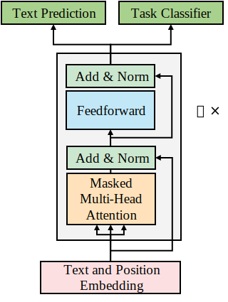

# GPT模型架构

Transformer模型在2017年底到2020年初的短短3年内,经历了从训练到微调(fine-tuning),再到零样本(zero-shot)模型的发展。一个零样本的GPT-3 Transformer模型不需要进行微调。训练好的模型参数不需要为下游的多任务进行更新,这为自然语言处理/理解任务开启了一个全新的时代。

在这一节中,我们首先将了解OpenAI团队设计GPT模型的动机。我们将从零样本模型的微调开始学习。接着我们将看到如何对Transformer模型进行调试,生成令人震惊的文本补全。最后,我们将探索GPT模型的架构。

## 十亿级参数Transformer模型的崛起

Transformer模型从小型的、针对自然语言处理任务训练的模型,发展到需要很少甚至不需要微调的模型,这个过程速度之快令人咋舌。

[Vaswani等人(2017年)](https://arxiv.org/pdf/1706.03762)提出了Transformer,它在BLEU任务上超越了CNN和RNN。[Radford等人(2018年)](https://www.mikecaptain.com/resources/pdf/GPT-1.pdf)提出了生成式预训练(GPT)模型,可以通过微调来完成下游任务。[Devlin等人(2019年)](https://arxiv.org/pdf/1810.04805.pdf)则完善了BERT模型的微调技术。[Radford等人(2019年)](https://insightcivic.s3.us-east-1.amazonaws.com/language-models.pdf)在此基础上进一步推出了GPT-2模型。

[Brown等人(2020)](https://arxiv.org/pdf/2005.14165)定义了一种不需要微调的GPT-3零样本(zero-shot)Transformer方法!

与此同时,[Wang等人（2019年）](https://arxiv.org/abs/1804.07461)创建了GLUE基准测试来评估自然语言处理模型。但Transformer模型进化速度如此之快,已经超越了人类基准线!

[Wang等人(2019年、2020年)](https://arxiv.org/abs/1905.00537)迅速创建了SuperGLUE,将人类基准线大幅提高,使自然语言理解/处理任务变得更加具有挑战性。Transformer模型正在飞速进步,有些模型已经在撰写本文时超越了SuperGLUE排行榜上的人类基准线。

这是如何发生得如此之快的?我们将从模型规模这个方面来了解这一演化过程。

## Transformer模型规模的增长

单单从2017年到2020年这段时间,模型参数数量就从最初的Transformer模型的65M参数增加到了GPT-3模型的175B参数,如下表所示:

|模型|论文|参数量|
|:----|:----|:----|
|Transformer Base| [Vaswani等人(2017年)](https://arxiv.org/pdf/1706.03762) |65M|
|Transformer Big| [Vaswani等人(2017年)](https://arxiv.org/pdf/1706.03762) |213M|
|BERT-Base| [Devlin等人(2019年)](https://arxiv.org/pdf/1810.04805.pdf) |110M|
|BERT-Large| [Devlin等人(2019年)](https://arxiv.org/pdf/1810.04805.pdf) |340M|
|GPT-2| [Radford等人(2019年)](https://insightcivic.s3.us-east-1.amazonaws.com/language-models.pdf) |117M|
|GPT-2| [Radford等人(2019年)](https://insightcivic.s3.us-east-1.amazonaws.com/language-models.pdf) |345M|
|GPT-2| [Radford等人(2019年)](https://insightcivic.s3.us-east-1.amazonaws.com/language-models.pdf) |1.5B|
|GPT-3| [Brown等人(2020)](https://arxiv.org/pdf/2005.14165) |175B|

上表中只列出了在那段短暂时期内设计的主要模型。论文发表的日期在模型实际设计完成之后。同时,作者们也对这些论文进行了更新。

例如,当最初的Transformer模型掀起市场热潮后,Google Brain、OpenAI和Facebook AI等机构都陆续推出了新的transformer模型。此外,一些GPT-2模型的参数量还大于较小的GPT-3模型。比如,GPT-3 Small模型只有125M参数,小于345M参数的某些GPT-2模型。

模型架构在同一时期也在不断发展:

- 模型的层数从最初Transformer的6层增加到了GPT-3的96层
- 每层的注意力头数从Transformer的8个增加到了GPT-3的96个
- 上下文长度从Transformer的512个token增加到了GPT-3的12,288个
- 模型架构规模的扩大,解释了为什么拥有96层的GPT-3 175B产生的结果比只有40层的GPT-2 1,542M更为出色。两个模型的参数量虽然可比,但层数已经翻了一番。

让我们关注一下上下文长度,以了解transformer快速进化的另一个方面。

### 上下文长度和最大路径长度

Transformer模型的基石在于注意力子层。相应地,注意力子层的关键属性是用于处理上下文大小的方法。

上下文大小是人类和机器学习语言的主要方式之一。上下文大小越大,我们就越能理解呈现给我们的序列。

然而,随着上下文的增加，理解一个词所需要的距离也会增加。分析这种长期依赖关系也是从递归机制转变为注意力机制的重要动机之一。

例如，在下面的句子中，“it”这个单词与其所指代的事物“house”就相距很远：

“Our *house* was too small to fit a big couch, a large table, and other furniture we would have liked in such a tiny space. We thought about staying for some time, but finally, we decided to sell *it*.”

“it”的含义只有在我们追溯到句子开头的“house”这个词时才能解释清楚。对于机器来说,这是一个相当漫长的路径!

RNN中的循环层需要逐步存储上下文的总长度。最大路径长度就是上下文大小。处理GPT-3模型上下文大小的RNN的最大长度大小将长0(n)倍。此外,RNN无法将上下文分成多个个头并在并行化的机器架构上运行,在多个个GPU上分散操作。而注意力机制将这一操作降低到了一对一的token操作，无论两个单词在序列中距离多远，它们都会在计算注意力时被同时考虑，因此最大路径长度为$O(1)$.

另外，由于Transformer中注意力机制的每一层都是相同的，这使得Transformer模型规模的扩展变得很方便。

## 从微调到零样本（Zero-shot）模型

从一开始,由Radford等人(2018年)领导的OpenAI研究团队就想要将Transformer从训练模型带到GPT模型。他们的目标是在未标注数据上训练Transformer。让注意力层从无监督数据中学习语言是一个聪明的举措。

OpenAI决定训练Transformer去学习语言,而不是教它们执行特定的自然语言处理任务。他们想创造一个与任务无关的模型。所以他们开始在原始数据上训练Transformer模型,而不是依赖专家标注的数据。标注数据是耗时的,并且会显著减慢Transformer的训练过程。

OpenAI选择了论文中提到的仅使用解码器的（Decoder-only）Transformer架构，其结果的指标令达到了同行自然语言处理研究实验室最佳模型的水平。

Radford等人(2019年)基于GPT的Transformer模型初版取得的可喜结果,并且很快推出了零样本迁移模型。他们的核心理念是继续训练GPT模型,让它们从原始文本中学习。

OpenAI进一步推进研究，[Brown等人(2020)](https://arxiv.org/pdf/2005.14165)基于这样的假设,即可以深入训练条件概率Transformer模型,并能够在很少或几乎不需要微调的情况下,对下游任务产生出色的结果。最终实现了在预训练模型上直接运行下游任务而无需进一步微调。这种令人惊叹的进展可以概括为四个阶段:

- 微调(Fine-Tuning, FT)是指我们在前几章探讨的方式。训练一个Transformer模型,然后在下游任务上进行微调。Radford等人(2018)设计了许多微调任务。OpenAI团队接下来逐步将任务数量减少到 0。
- 少样本(Few-Shot, FS)代表了巨大的进步。GPT模型经过训练。当需要进行推理时,会呈现任务的示范作为条件。条件取代了权重更新,这是GPT团队从过程中排除的。我们将在本章的笔记本中,通过提供的上下文对模型进行条件设置,以获得文本完成。
- 单样本(One-Shot, 1S)进一步推进了这一过程。训练好的GPT模型仅被呈现一个下游任务的示范。同样也不允许进行权重更新。
- 零样本(Zero-Shot, ZS)是最终目标。训练好的GPT模型不被呈现任何下游任务的示范。

这些方法各有不同的效率水平。OpenAI GPT团队一直在努力产出这些领先水平的Transformer模型。

我们现在可以解释GPT模型架构的动机:

- 通过广泛的训练,教会Transformer模型如何学习一种语言。
- 专注于通过上下文条件化进行语言建模。
- Transformer以一种全新的方式利用上下文生成文本完成。它不会消耗资源在学习下游任务上,而是致力于理解输入并做出推断,不管任务是什么。
- GPT只使用了Transformer解码器，解码器中的掩蔽多头注意力使Transformer只能看到上文不能看到下文，迫使Transformer以机器智能的方式思考。

## GPT解码器架构

GPT模型与Vaswani等人(2017)设计的原始Transformer有相同的解码器堆栈结构。可以回顾:ref:`ch2-sec1-decoder`。

GPT模型只使用了解码器，其架构如 :numref:`fig-ch7-sec2-fig1` 所示：

:label:`fig-ch7-sec2-fig1`

我们可以识别出GPT模型中包含以下组件:

- 文本和位置嵌入子层
- 遮蔽多头自注意力层
- 归一化子层
- 前馈子层
- 输出层

此外,还有一个 GPT-2 版本同时具备文本预测和任务分类的功能。

另外，与原始Transformer的解码器相比，GPT的架构中少了交叉注意力子层。这是因为GPT中没有编码器，不需要计算对编码器输出特征的注意力。

OpenAI团队一直在定制和微调解码器模型。Radford等人(2019)提出了不少于四个GPT模型,Brown等人(2020)也描述了不少于八个模型。通过不断的定制和优化,他们推动了GPT模型的发展。

GPT-3 175B模型已经达到了一个独特的规模,需要的计算资源是全世界只有少数团队能拥有的：

$$
n_\text{params}=175.0B, n_\text{layers}=96, d_\text{model}=12288, n_\text{heads}=96
$$

## GPT-3引擎

GPT-3模型可以被训练来完成不同规模的特定任务。OpenAI记录了当前可用的[各种GPT-3引擎](https://beta.openai.com/docs/engines)。这些引擎覆盖了不同的规模和功能。

GPT-3的基础引擎系列具有不同的功能:

- Davinci引擎擅长分析复杂的意图
- Curie引擎速度快,擅长文本摘要
- Babbage引擎擅长语义搜索
- Ada引擎擅长解析文本

OpenAI 正在推出更多的引擎供市场使用:

- Instruct系列可以根据描述提供指令
- Codex系列可以将自然语言转换为代码
- Content filter系列可以过滤掉不安全或敏感的文本
