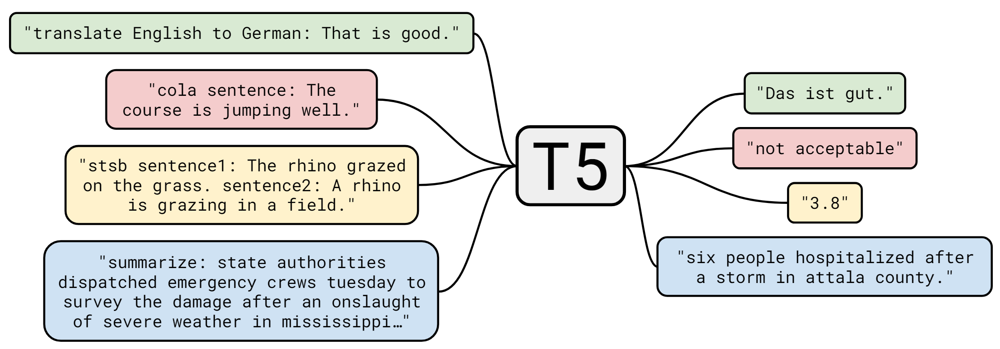
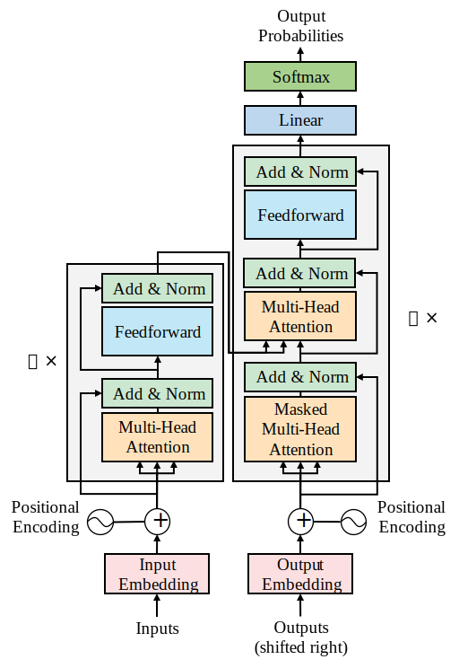

# 设计一个通用的文本到文本（text-to-text）模型

## Text-to-text模型的崛起

[Raffel等人(2019)](https://arxiv.org/pdf/1910.10683)以开拓者的姿态出发,目标是:探索统一的文本到文本Transformer在迁移学习方面的极限。从一开始,谷歌团队就强调,这种方法不会修改原始Transformer的基本架构。

那时,[Raffel等人(2019)](https://arxiv.org/pdf/1910.10683)想关注的是概念,而非技术。因此,他们不会像我们经常看到的那样,去制造所谓的“银弹Transformer模型”,即参数和层数众多的模型。这次,T5团队想弄清楚Transformer在理解语言方面有多出色。

人类学习一种语言,然后通过迁移学习将该知识应用于各种自然语言处理任务。T5模型的核心概念是找到一个抽象模型,能像我们一样做事。

T5模型可以总结为文本到文本迁移的Transformer。因此,每个自然语言处理任务都被表述为一个文本到文本的问题来解决。

## 为特定任务使用前缀而非指定输入输出格式

[Raffel等人(2019)](https://arxiv.org/pdf/1910.10683)仍然有一个需要解决的问题：统一特定任务的格式。其想法是找到一种方式,为提交给Transformer的每个任务都使用一种统一的输入格式。这样,模型参数就可以用一种文本到文本的格式进行所有类型任务的训练。

[Raffel等人(2019)](https://arxiv.org/pdf/1910.10683)提出添加前缀到输入序列。T5前缀不仅仅是像某些Transformer模型中用于分类的[CLS]这样的标签或指示符。相反,T5前缀是使用自然语言描述的，并包含了Transformer需要解决的任务的本质。前缀传达了如下例子所示的含义:

- `"translate English to German: " + 所需翻译的句子`
- `"cola sentence: " + CoLA数据集中的句子`
- `"summarize " + 所需摘要的句子`

这里的`"translate English to German: "`,`"cola sentence: "`和`"summarize "`都是前缀，分别表示翻译任务、语言可接受性分析（CoLA）任务、和摘要任务。

至此，我们可以将广泛的NLP任务总结为一个范式：

Prefix + Sequence A -> Sequence B

统一的输入格式使得T5中无论需要解决哪个问题,Transformer模型都能产生结果序列。如 :numref:`ch8-sec1-fig-1` 所示,许多自然语言处理任务的输入和输出已经被统一了。

:label:`ch8-sec1-fig-1`

统一化过程使得我们能够对广泛的NLP任务使用相同的模型、超参数和优化器。

我们已经了解了标准的文本到文本输入输出格式。现在让我们来看看T5模型的架构。

## T5模型架构

谷歌T5团队并不想尝试从原始Transformer衍生出的新架构,比如BERT式的编码器层或GPT式的解码器层。相反,该团队专注于以标准格式定义自然语言处理任务。

因此他们选用了原始transformer模型的架构，如 :numref:`ch8-sec-1-fig-2` 所示：

:label:`ch8-sec-1-fig-2`

谷歌T5团队保留了大部分原始Transformer的架构和术语，但也做了一些轻微的词汇和功能变更:

- 编码器和解码器仍然保留在模型中。编码器和解码器层统一成了"块", 子层变成了包含自注意力层和前馈网络的"子组件"。
- 在每一层进行自注意力的点积操作之前，会将位置编码添加到词嵌入中。
- 原始Transformer使用正弦和余弦函数进行位置嵌入。T5则使用相对位置嵌入，而不是将任意位置添加到输入中。
- 位置嵌入在模型的所有层都重新计算，参数共享。
